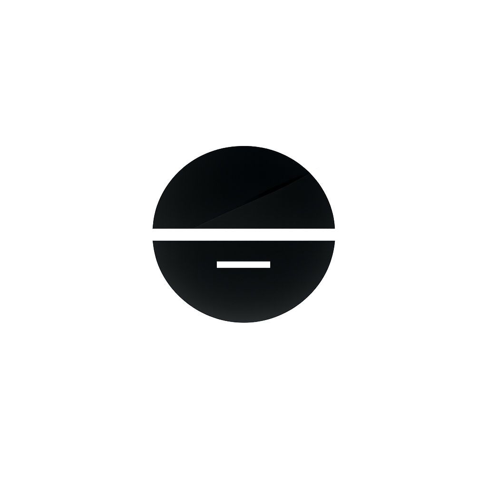

<p align="center">
  <picture>
    <source media="(prefers-color-scheme: dark)" srcset="assets/logo/logo-mark-dark-mode.png">
    <source media="(prefers-color-scheme: light)" srcset="assets/logo/logo-mark-light-mode.png">
    
  </picture>
</p>

<h1 align="center">promptpurify</h1>

[](https://github.com/securelayer7/PROMPTPurify/actions/workflows/ci.yml)
[](https://www.npmjs.com/package/promptpurify)
[](https://www.npmjs.com/package/promptpurify)
[](https://huggingface.co/Securelayer7/promptpurify)
[](LICENSE)
[](MODEL_CARD.md)
[](SECURITY.md)

**Tiny prompt-injection firewall for LLM chat apps. ~14 MB. CPU-only.**
Drop-in guard between your user input and your LLM — runs on the same box,
no GPU, no API, no extra service.

> Built by the [SecureLayer7](https://securelayer7.net) red-team. Most
> OSS guardrails are hundreds of MB, want a GPU, and still miss the
> attacks we see in production. We needed something we could ship inside
> our own AI products and our customers' apps without any of that.

## Why this exists

| | promptpurify | typical OSS guardrail |
|---|---|---|
| Install size | **~14 MB ONNX** | 180 MB – 7 GB |
| Inference | **CPU, single-digit ms** | GPU recommended |
| Where it runs | **In your Node process** | Sidecar or hosted API |
| Cost per call | **$0** | $ or GPU compute |

Benchmark comparison vs OSS baselines → [docs/BENCHMARKS.md](docs/BENCHMARKS.md).

## Install

```bash
# SDK (zero-dep, ~50 KB) — structural firewall + browser bundle
npm i promptpurify

# Add the model (~14 MB ONNX) for the chat-injection guard
npm i onnxruntime-node
curl -L -o promptpurify-model.tar.gz \
  https://github.com/securelayer7/PROMPTPurify/releases/download/v0.0.1/promptpurify-model.tar.gz
curl -L -o promptpurify-model.tar.gz.sha256 \
  https://github.com/securelayer7/PROMPTPurify/releases/download/v0.0.1/promptpurify-model.tar.gz.sha256
sha256sum -c promptpurify-model.tar.gz.sha256   # MUST print "OK"
tar xzf promptpurify-model.tar.gz                # creates models/l5e/
```

The model isn't in the npm tarball — the SDK stays tiny for people who
only want the structural firewall (browser, edge, RAG). Full
distribution options: [docs/SAMPLE-DATA.md](docs/SAMPLE-DATA.md#how-to-get-the-model).

## 3-line drop-in

```ts
import { createL5eRunner } from "promptpurify/l5";

const guard = await createL5eRunner();

// In your /chat handler:
const score = await guard.score(userMessage);
if (score >= 0.95) return refusal();              // hard block
if (score >= 0.85) flagForReview(userMessage);    // advisory
const reply = await yourLLM.complete(userMessage); // pass through
```

Works with Groq, OpenAI, Anthropic, vLLM, local LLMs —
promptpurify never talks to your LLM, only to your input.

For the deterministic structural firewall (Unicode neutralization,
role-fenced messages, output exfil guard) see
[docs/QUICKSTART.md](docs/QUICKSTART.md).

## Built from scratch

We built our model from random initialization because no existing OSS
guardrail gave us the size / latency tradeoff we wanted to ship in our
own products.

- **From-scratch.** No teacher weights from any vendor classifier are
  redistributed.
- **Benchmarked against public datasets** for direct comparison with OSS
  baselines (ProtectAI v2, deepset, Meta Prompt-Guard, Meta Prompt-Guard-2). Held-out
  evaluation; false positives reported alongside recall.
- **MIT-licensed weights.** Use in production, paid or free.

Full architecture overview → [docs/HOW-IT-WORKS.md](docs/HOW-IT-WORKS.md).

## Try to break it

We run a live adversarial challenge at
**[anton.securelayer7.net](https://anton.securelayer7.net)**. Ask Son of
Anton for the password. If you can get it past the guard, tell us how —
[SECURITY.md](SECURITY.md).

## Sample app

A fintech customer-support chatbot wired up with promptpurify, ready to
run locally:

```bash
cd examples/customer-support && npm install
GROQ_API_KEY=gsk_... node server.mjs
# http://localhost:8787
```

See [`examples/customer-support/README.md`](examples/customer-support/README.md).

## Read more

- **[docs/QUICKSTART.md](docs/QUICKSTART.md)** — install paths,
  structural firewall, browser bundle, integration patterns.
- **[docs/HOW-IT-WORKS.md](docs/HOW-IT-WORKS.md)** — the layers, what
  each catches.
- **[docs/BENCHMARKS.md](docs/BENCHMARKS.md)** — comparison with OSS
  baselines, methodology.
- **[docs/SAMPLE-DATA.md](docs/SAMPLE-DATA.md)** — what ships in the
  repo for benchmarking.
- **[docs/REPRODUCE.md](docs/REPRODUCE.md)** — run the bench yourself.
- **[docs/HONEST-LIMITS.md](docs/HONEST-LIMITS.md)** — what to pair
  promptpurify with for full coverage.

## What promptpurify is *not*

- Not a guarantee. There is no `.safe` boolean.
- Not a content classifier. Catches prompt-injection, not toxicity /
  CSAM / hate. Pair with a content filter.
- Not a multi-turn auditor. Pair with conversation-level monitoring.

## Verified releases

Everything we ship is signed and verifiable end-to-end:

- **npm package** signed with [npm provenance](https://docs.npmjs.com/generating-provenance-statements) from this exact GitHub Actions run. Verify locally:
  ```bash
  npm audit signatures   # ✓ verified registry signature + provenance attestation
  ```
- **Model tarball** ([releases](https://github.com/securelayer7/PROMPTPurify/releases/tag/v0.0.1)) carries a keyless [Sigstore cosign](https://sigstore.dev) signature (`*.cosign.bundle`), a [SLSA build provenance attestation](https://slsa.dev), a SHA256 manifest, and a CycloneDX SBOM (`SBOM.cdx.json`).
- **In-repo `models/l5e/SHA256SUMS`** — every artifact checksummed; verified in CI on every PR.

If any of those checks fail on your end, the package is not promptpurify — file a security report under [SECURITY.md](SECURITY.md).

## Acknowledgments

The name and the design philosophy are inspired by
[**DOMPurify**](https://github.com/cure53/DOMPurify) by [Cure53](https://cure53.de) —
the same idea, applied to LLM prompts instead of HTML. Thanks to
**Mario Heiderich** for suggesting the name.

## License

MIT for the SDK and the model weights. Benchmark sources we evaluate
against are listed in
[training/CORPUS_LICENSES.json](training/CORPUS_LICENSES.json).

Security disclosures: [SECURITY.md](SECURITY.md).
